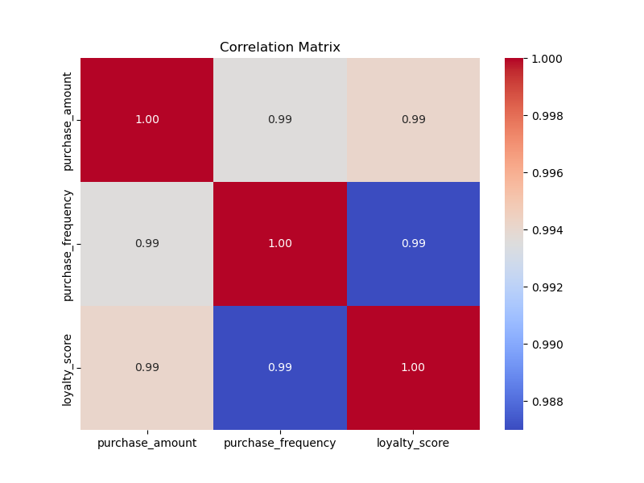

[](https://github.com/nogibjj/Mobasserul_Haque_IndividualProject1/actions/workflows/test.yml)
[](https://github.com/nogibjj/Mobasserul_Haque_IndividualProject1/actions/workflows/lint.yml)
[](https://github.com/nogibjj/Mobasserul_Haque_IndividualProject1/actions/workflows/install.yml)
[](https://github.com/nogibjj/Mobasserul_Haque_IndividualProject1/actions/workflows/format.yml)

# Pandas Descriptive Script Mini Project
This project performs exploratory data analysis (EDA) on a dataset containing customer purchasing behavior, providing insights into various patterns and relationships using pandas, Matplotlib, and Seaborn.

## Demo Video
The demo video for this **Individual Project 1**, is uploaded to this repo:  
[Demo video](demo.mp4)
[Demo Video YT link](https://www.youtube.com/watch?v=Egb39YCRVog)

## File Structure 
```
Mobasserul_Haque_IndividualProject1/
├── .devcontainer/
│   ├── devcontainer.json
│   └── Dockerfile
├── .github/
│   ├── workflows/format.yml
│   ├── workflows/install.yml
│   ├── workflows/lint.yml
│   ├── workflows/test.yml
├── mylib/
|   ├── __init__.py
│   ├── lib.py
├── bar_plot_average_purchase_amt_by_regions.png
├── Correlation_matrix_columns
├── Customer Purchasing Behaviors.csv                                        
├── Histogram_column_distributions.png                                      
├── Loyalty_score_by_region_boxplot.png                                  
├── main.ipynb                                   
├── main.py                             
├── Makefile                  
├── README.md                       
├── requirements.txt
├── scatter_plot_hue_by_region
├── scatter_plot_trend_line   
├── summary_report.md                  
├── test_lib.py
├── test_main.py
├── test_report.md                          
```


## Table of Content
- [Overview](#overview)
- [Source](#source)
- [About Dataset](#about-dataset)
  - [Dataset Columns](#dataset-columns)
- [Features](#features)
- [Summary Statistics](#summary-statistics)
- [Data Visualization](#data-visualization)
- [Setup](#setup)
  - [Development Environment (Dev Container)](#development-environment-dev-container)
  - [Makefile](#makefile)
  - [GitHub Actions](#github-actions)
- [Usage](#usage)
  - [Histograms](#histograms)
  - [Scatter Plot with Hue](#scatter-plot-with-hue)
  - [Box Plot by Category](#box-plot-by-category)
  - [Correlation Heatmap](#correlation-heatmap)
  - [Scatter Plot with Trend Line](#scatter-plot-with-trend-line)
  - [Bar Plot by Category](#bar-plot-by-category)
- [Running Tests](#running-tests)
- [Dependencies](#dependencies)
- [License](#license)

## Overview
This project focuses on analyzing customer purchasing behavior using a dataset in CSV format. It generates various statistical summaries and visualizations to help understand trends, relationships, and distributions in the data.

## Source
The dataset used in this project is **Customer Purchasing Behaviors**, which can be found on Kaggle:  


## About Dataset

### Dataset Columns
- **customer_id**: Unique ID of the customer.
- **age**: The age of the customer.
- **annual_income**: The customer's annual income (in USD).
- **purchase_amount**: The total amount of purchases made by the customer (in USD).
- **purchase_frequency**: Frequency of customer purchases (number of times per year).
- **region**: The region where the customer lives (North, South, East, West).
- **loyalty_score**: Customer's loyalty score (a value between 0-100).

This dataset includes information on customer profiles and their purchasing behaviors. 
The data features columns for user ID, age, annual income, purchase amount, loyalty score, region, and purchase frequency. It is intended for analyzing customer segmentation and loyalty trends, and can be used for various machine learning and data analysis tasks related to customer behavior and market research.

## Features
- Display summary statistics, including median, range, and variance.
- Visualize data distributions with histograms.
- Plot scatter plots with categories (hue).
- Compare distributions across categories using box plots.
- Analyze correlations between numerical variables with a heatmap.
- Create scatter plots with trend lines for relationship analysis.
- Generate bar plots comparing categorical data.

## Summary Statistics
The `summary_statistics` function displays key metrics like the median, range, and variance for each numerical column.

|                | count      | mean         | std          | min   | 25%   | 50%   | 75%    | max   | median | range  | variance      |
|----------------|------------|--------------|--------------|-------|-------|-------|--------|-------|--------|--------|---------------|
| user_id        | 238.0      | 119.500000   | 68.848868    | 1.0   | 60.25 | 119.5 | 178.750 | 238.0 | 119.5  | 237.0  | 4.740167e+03 |
| age            | 238.0      | 38.676471    | 9.351118     | 22.0  | 31.00 | 39.0  | 46.750 | 55.0  | 39.0   | 33.0   | 8.744341e+01 |
| annual_income  | 238.0      | 57407.563025 | 11403.875717 | 30000.0 | 50000.00 | 59000.0 | 66750.000 | 75000.0 | 59000.0 | 45000.0 | 1.300484e+08 |
| purchase_amount| 238.0      | 425.630252   | 140.052062   | 150.0 | 320.00 | 440.0 | 527.500 | 640.0 | 440.0  | 490.0  | 1.961458e+04 |
| loyalty_score  | 238.0      | 6.794118     | 1.899047     | 3.0   | 5.50  | 7.0   | 8.275  | 9.5   | 7.0    | 6.5    | 3.606379e+00 |
| purchase_frequency | 238.0   | 19.798319    | 4.562884     | 10.0  | 17.00 | 20.0  | 23.000 | 28.0  | 20.0   | 18.0   | 2.081991e+01 |
## Data Visualization

Below are sample visualizations produced by the project:

- **Distribution of Columns:**
  

- **Loyalty Score by Region:**
  

- **Scatter Plot with Hue (Region):**
  

- **Scatter Plot with Trend Line:**
  

- **Correlation Matrix:**
  

- **Bar Plot of Average Purchase Amount by Region:**
  

## Setup

### Development Environment (Dev Container)
This project includes a development container setup, enabling you to develop in a fully configured environment. The container is based on the official Python image and installs all necessary dependencies.

To use the development container, ensure you have Docker installed and a supported code editor like VSCode. The editor will prompt you to "Reopen in Container" when the project is loaded.

### Makefile
The repository includes a `Makefile` to simplify the setup and execution of key commands.

- Install dependencies:
    ```bash
    make install
    ```

- Run linting checks using `pylint`:
    ```bash
    make lint
    ```

- Run tests:
    ```bash
    make test
    ```

- Clean up the environment:
    ```bash
    make clean
    ```

### GitHub Actions
This repository is equipped with GitHub Actions for continuous integration (CI). The workflow runs linting and testing automatically upon each push or pull request.

To view the status of the CI pipeline, navigate to the **Actions** tab of your repository on GitHub.

## Usage

### Histograms
The `plot_histograms` function generates histograms for specified columns in the dataset, displaying the distribution of values. The histograms are saved as images and embedded in the summary report. 

To use this function, you can call it with the following code:

```python
plot_histograms(df, ['age', 'annual_income', 'purchase_amount', 'purchase_frequency'], output_report)
```
This will produce histograms for the columns `age`, `annual_income`, `purchase_amount`, and `purchase_frequency`, showing the distribution of values for each. The generated histogram images are saved as `Histogram_column_distributions.png` and are included in the summary report.

### Scatter Plot with Hue

The `plot_scatter_with_hue` function visualizes the relationship between two specified columns, colored by a categorical hue. The scatter plot is saved as an image and embedded in the summary report.

To use this function, you can call it with the following code:

```python
plot_scatter_with_hue(df, 'annual_income', 'purchase_amount', 'region', output_report)
```
This will generate a scatter plot showing the relationship between `annual_income` and `purchase_amount`, with different colors representing the `region`. The generated scatter plot image is saved as `scatter_plot_hue_by_region.png` and is included in the summary report.

### Box Plot by Category

The `plot_box_by_category` function compares the distribution of a numerical column across different categories using a box plot. The box plot is saved as an image and embedded in the summary report.

To use this function, you can call it with the following code:

```python
plot_box_by_category(df, 'region', 'loyalty_score', output_report)
```
This will generate a box plot comparing the `distribution of loyalty_score` across different `regions`. The generated box plot image is saved as `Loyalty_score_by_region_boxplot.png` and is included in the summary report.

### Correlation Heatmap
The `plot_correlation_heatmap` function visualizes the correlation matrix between specified numerical columns using a heatmap. The heatmap is saved as an image and embedded in the summary report.

To use this function, you can call it with the following code:

```python
plot_correlation_heatmap(df, ['purchase_amount', 'purchase_frequency', 'loyalty_score'], output_report)
```
This will generate a heatmap showing the correlation matrix for `purchase_amount`, `purchase_frequency`, and `loyalty_score`. The generated heatmap image is saved as `Correlation_matrix_columns.png` and is included in the summary report.

### Scatter Plot with Trend Line
The `plot_scatter_with_trend` function visualizes the relationship between two specified columns with a trend line to show the overall trend. The scatter plot with the trend line is saved as an image and embedded in the summary report.

To use this function, you can call it with the following code:

```python
plot_scatter_with_trend(df, 'annual_income', 'purchase_amount', output_report)
```
This will generate a scatter plot showing the relationship between `annual_income` and `purchase_amount`, with a trend line included. The generated scatter plot image with the trend line is saved as `scatter_plot_trend_line.png` and is included in the summary report.

### Bar Plot by Category
The `plot_bar_by_category` function compares the average values of a numerical column across different categories using a bar plot. The bar plot is saved as an image and embedded in the summary report.

To use this function, you can call it with the following code:

```python
plot_bar_by_category(df, 'region', 'purchase_amount', output_report)
```
This will generate a bar plot comparing the `average purchase_amount by region`. The generated bar plot image is saved as `bar_plot_average_purchase_amt_by_regions.png` and is included in the summary report.

