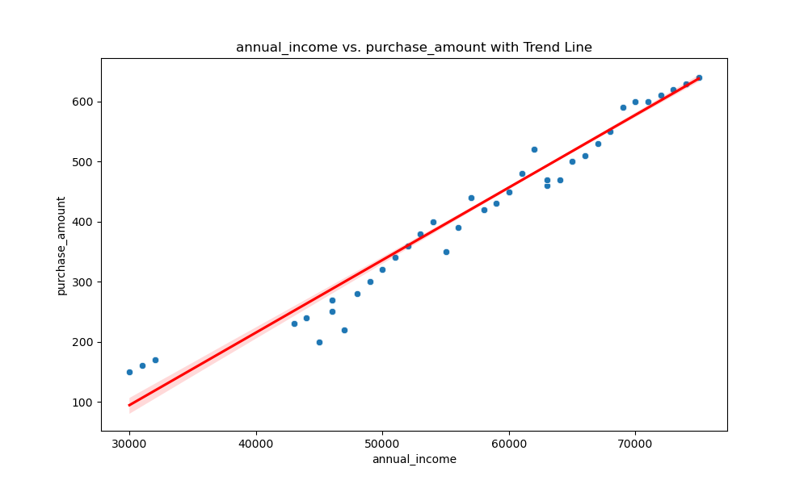
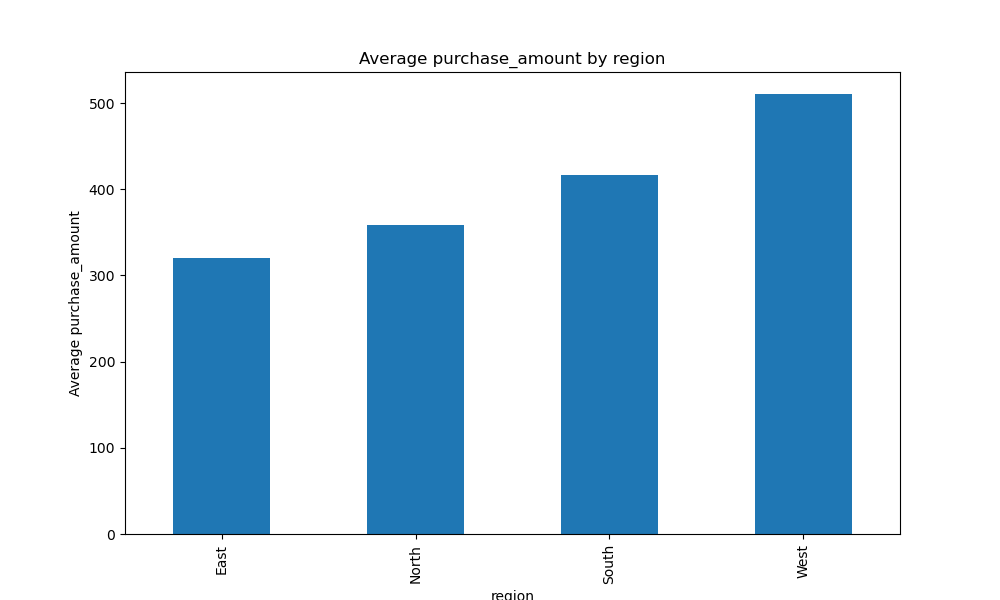

[](https://colab.research.google.com/github/nogibjj/Mobasserul_Haque_MiniProject9/blob/main/collab_main.ipynb)
[](https://github.com/nogibjj/Mobasserul_Haque_MiniProject9/actions/workflows/cicd.yml)

# Cloud-Hosted Notebook Data Manipulation

This project demonstrates data manipulation and exploratory data analysis (EDA) on a sample dataset using a cloud-hosted Jupyter Notebook on Google Colab. The notebook integrates with GitHub for version control and sharing.

---
## Project Overview

This project performs EDA on a dataset containing customer purchasing behavior using Python libraries like pandas, Matplotlib, and Seaborn. It also highlights the seamless integration between Google Colab and GitHub for cloud-based data analysis and collaboration.

## Collab Jupyter Notebook:

[https://colab.research.google.com/github/nogibjj/Mobasserul_Haque_MiniProject9/blob/main/collab_main.ipynb](https://colab.research.google.com/github/nogibjj/Mobasserul_Haque_MiniProject9/blob/main/collab_main.ipynb)

---

## File Structure 
```
├── .devcontainer/
│   ├── devcontainer.json
│   └── Dockerfile
├── .github/
│   └── workflows/
│       └── cicd.yml
├── myLib/
│   ├── __pycache__/
│   ├── __init__.py
│   ├── lib.py
├── bar_plot_average_purchase_amt_by_regions.png
├── collab_main.ipynb
├── Correlation_matrix_columns.png
├── Customer Purchasing Behaviors.csv
├── demo.mp4
├── Histogram_column_distributions.png
├── Loyalty_score_by_region_boxplot.png
├── main.ipynb
├── main.py
├── Makefile
├── README.md
├── requirements.txt
├── scatter_plot_hue_by_region.png
├── scatter_plot_trend_line.png
├── summary_report.md
├── test_lib.py
├── test_main.py
├── test_report.md                        
```
##  Setup Instructions

### 1. Access Google Colab

- Go to [Google Colab](https://colab.research.google.com).
- Sign in with your Google account.
- Open the notebook directly by clicking the "Open in Colab" badge above or follow these steps:
  - Create a new notebook by selecting **File > New Notebook**.
  - Alternatively, open an existing notebook from your GitHub repository.

### 2. Clone the Repository in Colab

To access all project files in Colab, clone the repository by running the following in a notebook cell:

```bash
!git clone https://github.com/nogibjj/Mobasserul_Haque_MiniProject9.git
```
Navigate to the Project Directory

```bash
%cd Mobasserul_Haque_MiniProject9
```
### 3. Install Dependencies

Install the required Python libraries using the `requirements.txt` file:

```bash
!pip install -r requirements.txt
```
### Run the Notebook

Open the `collab_main.ipynb` file in Colab and run all the cells to execute the data manipulation and visualization tasks.


---
## Features

- **Summary Statistics**: Summary statistics of customer purchasing data.
- **Data Visualizations**: Including histograms, scatter plots, box plots, and correlation heatmaps.
- **Google Colab Integration**: Run Jupyter notebooks in the cloud.

## Source
The dataset used in this project is **Customer Purchasing Behaviors**, which can be found on Kaggle:  


## About Dataset

### Dataset Columns
- **customer_id**: Unique ID of the customer.
- **age**: The age of the customer.
- **annual_income**: The customer's annual income (in USD).
- **purchase_amount**: The total amount of purchases made by the customer (in USD).
- **purchase_frequency**: Frequency of customer purchases (number of times per year).
- **region**: The region where the customer lives (North, South, East, West).
- **loyalty_score**: Customer's loyalty score (a value between 0-100).

## Summary Statistics
The `summary_statistics` function displays key metrics like the median, range, and variance for each numerical column.

|                | count      | mean         | std          | min   | 25%   | 50%   | 75%    | max   | median | range  | variance      |
|----------------|------------|--------------|--------------|-------|-------|-------|--------|-------|--------|--------|---------------|
| user_id        | 238.0      | 119.500000   | 68.848868    | 1.0   | 60.25 | 119.5 | 178.750 | 238.0 | 119.5  | 237.0  | 4.740167e+03 |
| age            | 238.0      | 38.676471    | 9.351118     | 22.0  | 31.00 | 39.0  | 46.750 | 55.0  | 39.0   | 33.0   | 8.744341e+01 |
| annual_income  | 238.0      | 57407.563025 | 11403.875717 | 30000.0 | 50000.00 | 59000.0 | 66750.000 | 75000.0 | 59000.0 | 45000.0 | 1.300484e+08 |
| purchase_amount| 238.0      | 425.630252   | 140.052062   | 150.0 | 320.00 | 440.0 | 527.500 | 640.0 | 440.0  | 490.0  | 1.961458e+04 |
| loyalty_score  | 238.0      | 6.794118     | 1.899047     | 3.0   | 5.50  | 7.0   | 8.275  | 9.5   | 7.0    | 6.5    | 3.606379e+00 |
| purchase_frequency | 238.0   | 19.798319    | 4.562884     | 10.0  | 17.00 | 20.0  | 23.000 | 28.0  | 20.0   | 18.0   | 2.081991e+01 |
## Data Visualization

Below are sample visualizations produced by the project:

- **Distribution of Columns:**
  

- **Loyalty Score by Region:**
  

- **Scatter Plot with Hue (Region):**
  

- **Scatter Plot with Trend Line:**
  

- **Correlation Matrix:**
  

- **Bar Plot of Average Purchase Amount by Region:**
  

## Continuous Integration (CI)

The repository includes a GitHub Actions CI pipeline for automated testing, linting, and build checks.

To view the status, navigate to the **Actions** tab on GitHub.

---

## Collaborate and Share

- Save your notebook changes to GitHub by selecting **File > Save a copy in GitHub** from Colab.
- Push updates directly to your GitHub repository.


