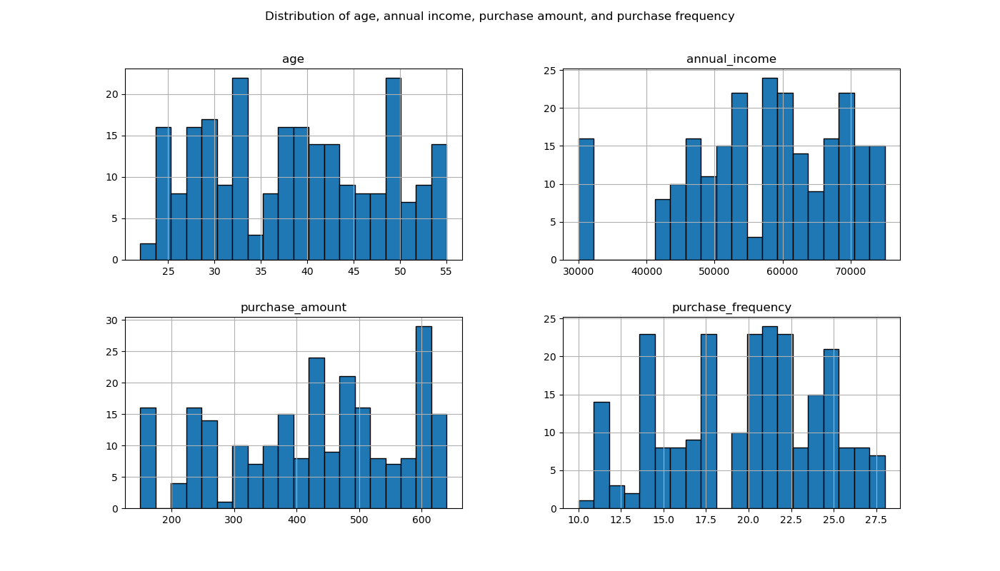
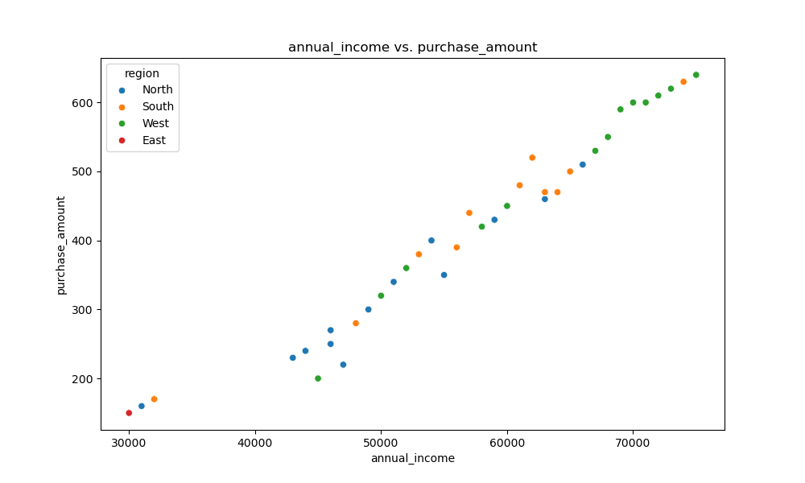
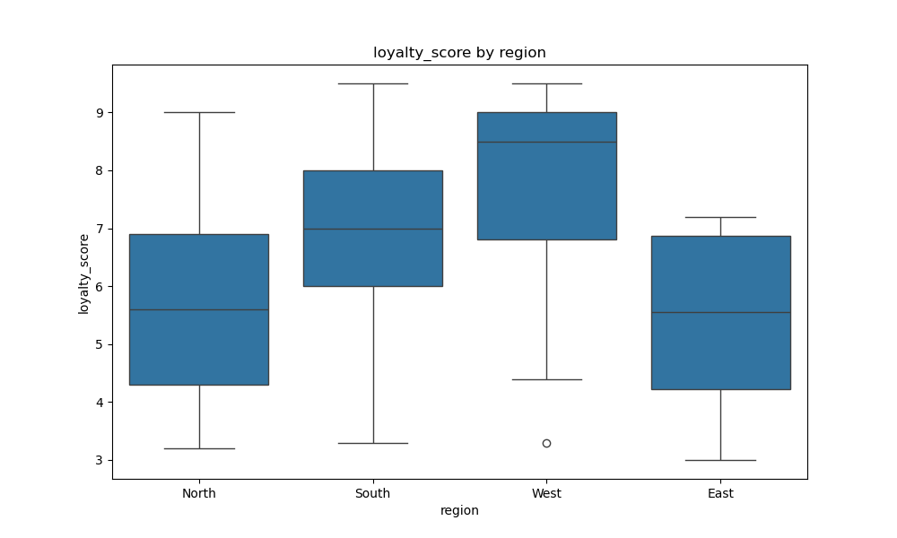
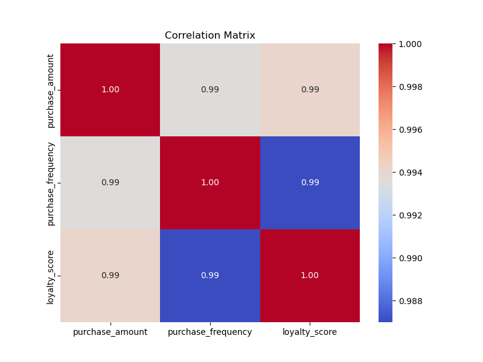
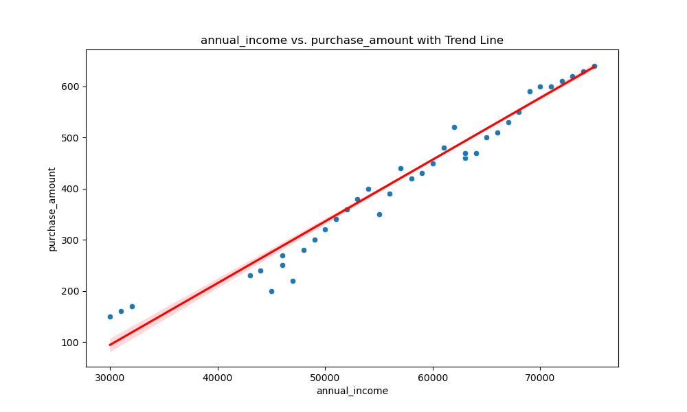
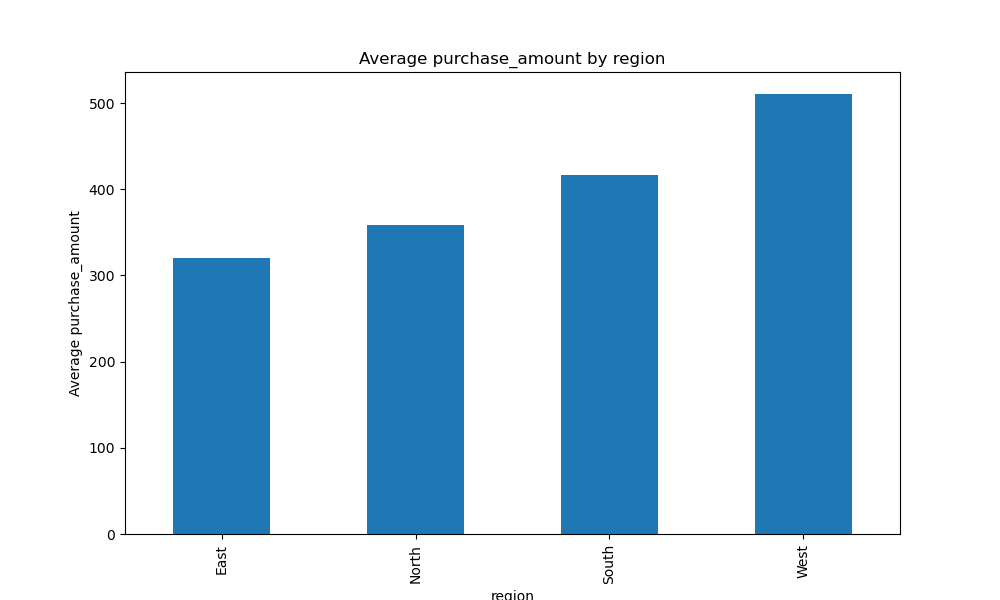

### Summary Statistics

|                | count      | mean         | std          | min   | 25%   | 50%   | 75%    | max   | median | range  | variance      |
|----------------|------------|--------------|--------------|-------|-------|-------|--------|-------|--------|--------|---------------|
| user_id        | 238.0      | 119.500000   | 68.848868    | 1.0   | 60.25 | 119.5 | 178.750 | 238.0 | 119.5  | 237.0  | 4.740167e+03 |
| age            | 238.0      | 38.676471    | 9.351118     | 22.0  | 31.00 | 39.0  | 46.750 | 55.0  | 39.0   | 33.0   | 8.744341e+01 |
| annual_income  | 238.0      | 57407.563025 | 11403.875717 | 30000.0 | 50000.00 | 59000.0 | 66750.000 | 75000.0 | 59000.0 | 45000.0 | 1.300484e+08 |
| purchase_amount| 238.0      | 425.630252   | 140.052062   | 150.0 | 320.00 | 440.0 | 527.500 | 640.0 | 440.0  | 490.0  | 1.961458e+04 |
| loyalty_score  | 238.0      | 6.794118     | 1.899047     | 3.0   | 5.50  | 7.0   | 8.275  | 9.5   | 7.0    | 6.5    | 3.606379e+00 |
| purchase_frequency | 238.0   | 19.798319    | 4.562884     | 10.0  | 17.00 | 20.0  | 23.000 | 28.0  | 20.0   | 18.0   | 2.081991e+01 |

### Summary Statistics
                    count          mean           std      min       25%      50%        75%      max   median    range      variance
user_id             238.0    119.500000     68.848868      1.0     60.25    119.5    178.750    238.0    119.5    237.0  4.740167e+03
age                 238.0     38.676471      9.351118     22.0     31.00     39.0     46.750     55.0     39.0     33.0  8.744341e+01
annual_income       238.0  57407.563025  11403.875717  30000.0  50000.00  59000.0  66750.000  75000.0  59000.0  45000.0  1.300484e+08
purchase_amount     238.0    425.630252    140.052062    150.0    320.00    440.0    527.500    640.0    440.0    490.0  1.961458e+04
loyalty_score       238.0      6.794118      1.899047      3.0      5.50      7.0      8.275      9.5      7.0      6.5  3.606379e+00
purchase_frequency  238.0     19.798319      4.562884     10.0     17.00     20.0     23.000     28.0     20.0     18.0  2.081991e+01

### Summary Statistics
                    count          mean           std      min       25%      50%        75%      max   median    range      variance
user_id             238.0    119.500000     68.848868      1.0     60.25    119.5    178.750    238.0    119.5    237.0  4.740167e+03
age                 238.0     38.676471      9.351118     22.0     31.00     39.0     46.750     55.0     39.0     33.0  8.744341e+01
annual_income       238.0  57407.563025  11403.875717  30000.0  50000.00  59000.0  66750.000  75000.0  59000.0  45000.0  1.300484e+08
purchase_amount     238.0    425.630252    140.052062    150.0    320.00    440.0    527.500    640.0    440.0    490.0  1.961458e+04
loyalty_score       238.0      6.794118      1.899047      3.0      5.50      7.0      8.275      9.5      7.0      6.5  3.606379e+00
purchase_frequency  238.0     19.798319      4.562884     10.0     17.00     20.0     23.000     28.0     20.0     18.0  2.081991e+01

### Summary Statistics
                    count          mean           std      min       25%      50%        75%      max   median    range      variance
user_id             238.0    119.500000     68.848868      1.0     60.25    119.5    178.750    238.0    119.5    237.0  4.740167e+03
age                 238.0     38.676471      9.351118     22.0     31.00     39.0     46.750     55.0     39.0     33.0  8.744341e+01
annual_income       238.0  57407.563025  11403.875717  30000.0  50000.00  59000.0  66750.000  75000.0  59000.0  45000.0  1.300484e+08
purchase_amount     238.0    425.630252    140.052062    150.0    320.00    440.0    527.500    640.0    440.0    490.0  1.961458e+04
loyalty_score       238.0      6.794118      1.899047      3.0      5.50      7.0      8.275      9.5      7.0      6.5  3.606379e+00
purchase_frequency  238.0     19.798319      4.562884     10.0     17.00     20.0     23.000     28.0     20.0     18.0  2.081991e+01

